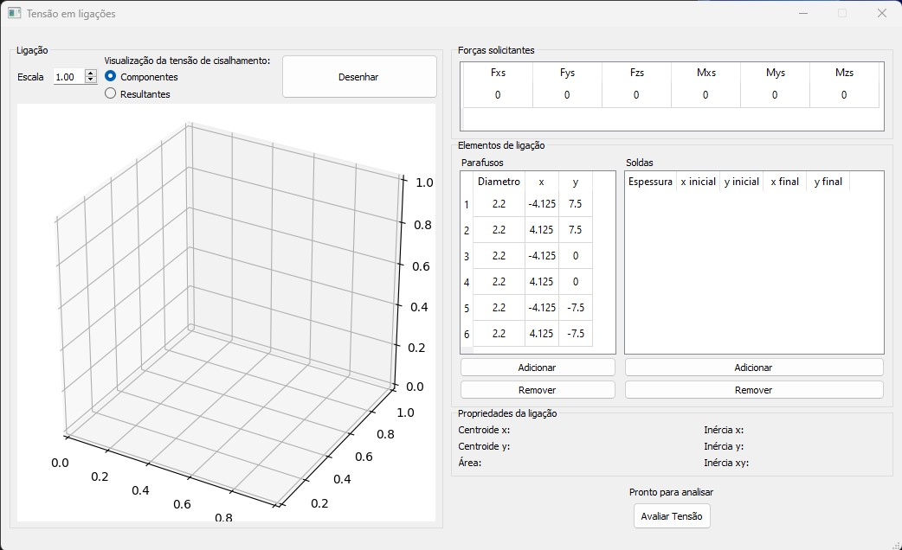
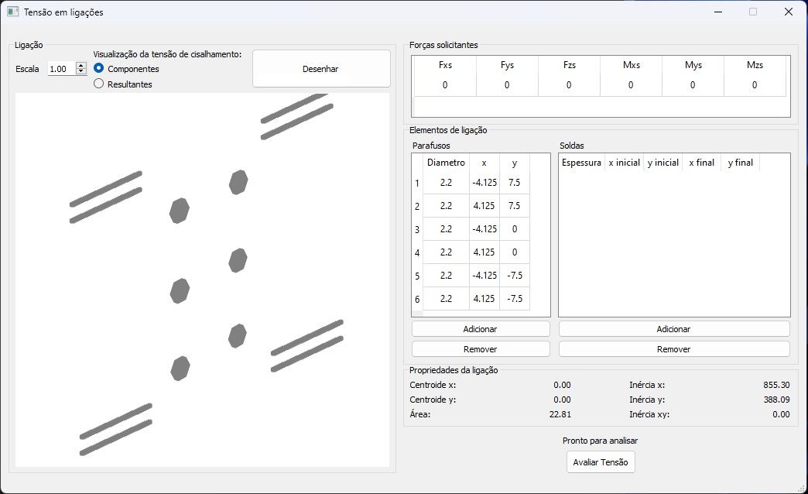
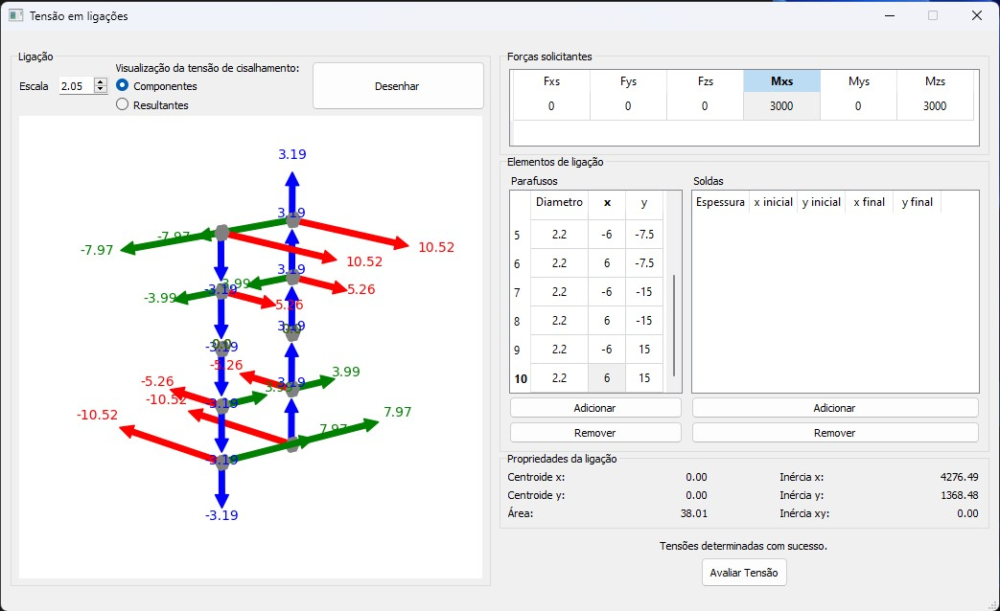
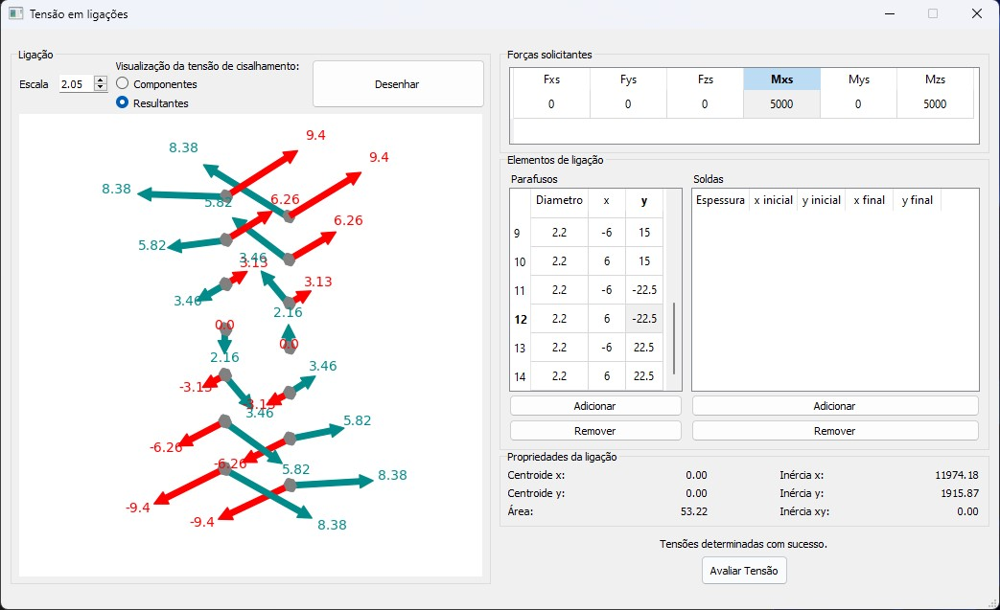

# Tensão Ligação
O programa proporciona uma abordagem simples e intuitiva para inserção dos dados relacionados à ligação, tais como posição e dimensões dos parafusos e filetes de solda. Com base nessas informações, o programa determina as propriedades geométricas da ligação e calcula as tensões utilizando as equações 

$$\sigma_z = \frac{F_z}{A} + \frac{(M_x I_y + M_y I_{xy})y - (M_y I_x + M_x I_{xy})x}{I_x I_y - I_{xy}^2}$$

$$\tau_x=\frac{F_x}{A}+\frac{M_z y}{I_z}$$ 

$$\tau_y=\frac{F_y}{A}+\frac{M_z x}{I_z}$$

## Funcionamento

Após a descrição da ligação na interface, o programa automatiza a determinação da rigidez da ligação e realiza o cálculo das tensões utilizando as equações supracitadas. Essa abordagem simplifica e torna o processo eficiente e acessível, podendo ser utilizada por estudantes e engenheiros.

## Principais Funcionalidades

- **Entrada de Dados Intuitiva:** O programa permite a entrada fácil e intuitiva de dados, com representação gráfica em três dimensões dos elementos inseridos. Isso não apenas facilita a compreensão do que está sendo inserido, mas também ajuda na detecção de possíveis erros.

- **Visualização 3D dos Resultados:** As saídas do programa são apresentadas por meio de vetores de tensão no espaço tridimensional. Essa representação visual aprimora a compreensão dos resultados, atendendo tanto a engenheiros experientes quanto a estudantes, proporcionando uma análise de simples interpretação da distribuição de tensão nos elementos da ligação.

## Screenshots

  
  
  
  

## Download
* __Executavel para Windows__: [Download](https://github.com/EVWTRENTINI/TensaoLigacao/releases/download/v1.1/Tensao.Ligacao.exe) 

## Links
* __Email para contato__: [etrentini@ufu.br](mailto:etrentini@ufu.br)

